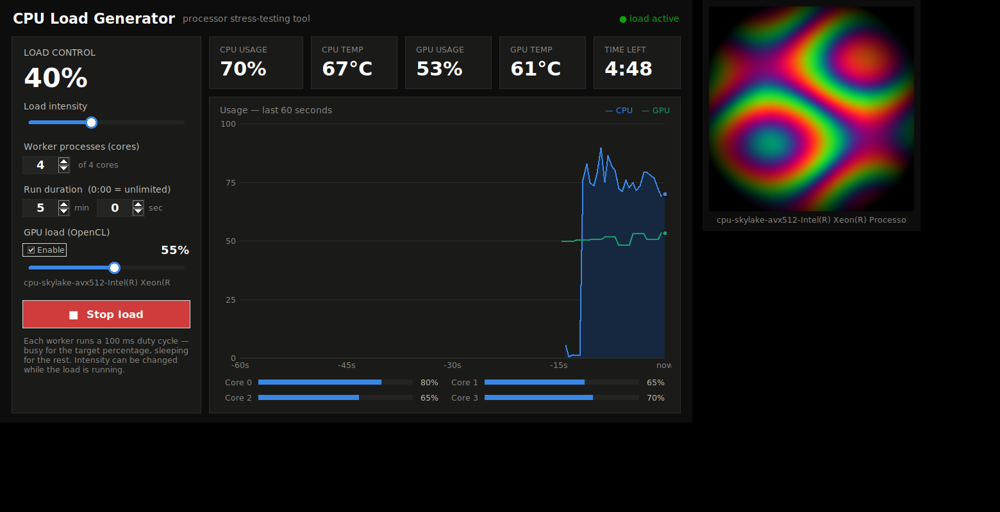

# CPU Load Generator · מחולל עומס CPU

A Python desktop app (tkinter GUI, English UI) that stresses the CPU at a chosen intensity for a chosen duration, showing live usage and temperature.

תוכנת Python עם GUI שולחני שמעמיסה על המעבד בעוצמה ולמשך זמן שקובעים, ומציגה בזמן אמת את העומס ואת הטמפרטורה.



## Quick start · הפעלה

```bash
python3 cpu_load_gui.py
```

No dependencies — Python standard library only.

- **Linux (Debian/Ubuntu):** if tkinter is missing, `sudo apt install python3-tk`.
- **Windows:** tkinter is included with the standard Python installer. Install `psutil` (`pip install psutil`) to enable CPU-usage readings.

## Features

* **Intensity slider (0–100%)** — each worker runs a 100 ms duty cycle (busy for the target percentage, sleeping for the rest); adjustable live while running
* **GPU load (OpenCL)** — optional stress on the graphics card with its own intensity slider; uses the OpenCL runtime that ships with GPU drivers, no Python packages needed
* **Stress animation window** — FurMark-style: while the GPU load runs, a resizable window shows a live plasma animation that is computed pixel-by-pixel on the GPU — the animation itself is the load. The intensity slider sets the actual GPU busy fraction, and the work size auto-calibrates to the card's speed (an RTX gets thousands of times more math per burst than an iGPU). Closing the window keeps the load running
* **Run duration** — minutes : seconds with auto-stop and a live countdown; 0:00 = unlimited (stops CPU and GPU together)
* **Live usage display** — CPU and GPU percentages on a 60-second history chart, plus a bar per core
* **CPU & GPU temperature** — color-coded (amber from 70°C, red from 85°C); shows "—" when no sensor is readable
* **Worker-count control** — choose how many cores to load (up to 2× core count)
* **Logging to a file** — optional sampling every 1 / 5 / 10 minutes: timestamp, CPU/GPU usage and temperature, and the current load settings. Choose the format — **Text (.txt)** for a readable log, or **Excel (.csv)** for a spreadsheet with one column per metric that opens straight in Excel. Every logging session creates a fresh timestamped file next to the program (home-folder fallback), and an **Open log** button opens the current file. Handy for long burn-in runs

## Temperature readings · קריאת טמפרטורה

| Platform | Source |
|---|---|
| Linux | `/sys/class/thermal` and hwmon sensors (or `psutil` if installed) |
| Windows | WMI via PowerShell: [LibreHardwareMonitor](https://github.com/LibreHardwareMonitor/LibreHardwareMonitor) / OpenHardwareMonitor sensors if the app is running, otherwise the ACPI thermal zone |
| WSL | Windows WMI through `powershell.exe` |

**Windows note:** many PCs don't expose CPU temperature to Windows at all — the reliable source is **LibreHardwareMonitor** ([download the ZIP](https://github.com/LibreHardwareMonitor/LibreHardwareMonitor/releases), free). **Put its folder inside the program's folder and you're done**: on startup, if no temperature is readable, the app finds it, configures it to start minimized to the tray, and launches it automatically (one UAC prompt) — the temperature fills in within seconds. Without it, the app falls back to the ACPI thermal zone, which usually needs the **"click to restart as Administrator"** link shown in the temperature tile — and on many desktops isn't available at all.

```
YourFolder/
├── cpu_load_gui.py        (or your built .exe)
└── LibreHardwareMonitor/
    └── LibreHardwareMonitor.exe
```

**הערה ל-Windows:** אם הטמפרטורה מציגה "—", יופיע בכרטיס הטמפרטורה קישור **"click to restart as Administrator"** — לחיצה עליו מפעילה את התוכנה מחדש עם הרשאות מנהל (חלון UAC) באופן אוטומטי. לחלופין, הריצו LibreHardwareMonitor ברקע והתוכנה תזהה את החיישן שלו. אם לחשבון שלכם אין הרשאות מנהל בכלל — Windows לא מאפשר קריאת טמפרטורה, והכרטיס יישאר "—".

## GPU load & readings · עומס וניטור GPU

- **Load generation** works on any GPU with an OpenCL driver (NVIDIA, AMD, Intel — included in the regular graphics driver). If the GPU section shows "No OpenCL GPU detected", update your graphics driver.
- **Multi-GPU machines** (e.g. onboard Intel + discrete NVIDIA): the discrete card is selected automatically, and a dropdown under the GPU slider lets you switch cards — even mid-run.
- **Usage / temperature readings** come from `nvidia-smi` (NVIDIA, Windows & Linux) or sysfs (AMD on Linux). On AMD/Intel under Windows the readings show "—", but the load itself still works — you can watch usage in Task Manager's GPU tab.

**עברית:** יצירת העומס עובדת על כל כרטיס מסך עם דרייבר OpenCL (מגיע עם הדרייבר הרגיל של NVIDIA/AMD/Intel). קריאת השימוש והטמפרטורה זמינה בכרטיסי NVIDIA (דרך `nvidia-smi`); ב-AMD/Intel ב-Windows המדדים יציגו "—" אבל העומס עצמו עובד — אפשר לראות את השימוש ב-Task Manager בלשונית GPU.

> ⚠️ This tool is for stress-testing your own machine (cooling, throttling, behavior under load). A sustained 100% load heats the CPU and GPU — use common sense.
