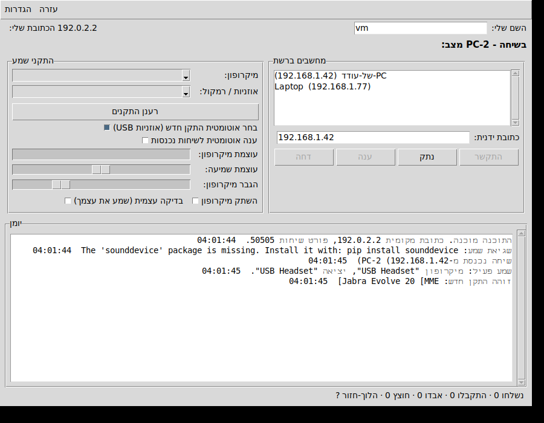
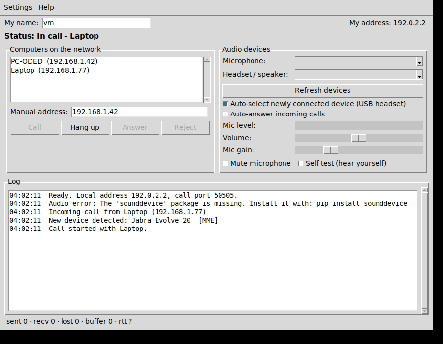

# LAN Phone — שיחות קוליות בין שני מחשבים ברשת מקומית

תוכנת שיחה (VoIP) לשני אנשים על שני מחשבי Windows המחוברים לאותו ראוטר.
השמע עובר ישירות בין שני המחשבים בתוך הרשת המקומית — בלי שרת, בלי אינטרנט,
בלי הרשמה. התוכנה בנויה במיוחד לעבוד עם **אוזניות USB שמתחברות אחרי שהתוכנה
כבר רצה**: כפתור "רענן התקנים" סורק מחדש את התקני השמע ומעביר את השיחה לאוזניות
שזה עתה חוברו.



---

## מה צריך

| |  |
|---|---|
| מערכת הפעלה | Windows 10 / 11 (עובד גם על Linux ו-macOS) |
| Python | גרסה 3.9 ואילך, מ-[python.org](https://www.python.org/downloads/windows/) |
| ספריות | `numpy` ו-`sounddevice` (מותקנות אוטומטית בהפעלה הראשונה) |
| רשת | שני המחשבים על אותו ראוטר / אותה רשת מקומית |

בזמן התקנת Python חשוב לסמן **"Add python.exe to PATH"**.
ההתקנה מ-python.org כוללת את `tkinter` שדרוש לממשק הגרפי.

## התקנה והפעלה

1. העתיקו את התיקייה הזאת לשני המחשבים (או הורידו את המאגר בשניהם).
2. בכל מחשב לחצו לחיצה כפולה על **`run.bat`**.
   בהפעלה הראשונה הסקריפט מתקין את `numpy` ו-`sounddevice` ואז פותח את החלון.
3. בפעם הראשונה Windows יציג חלון של חומת האש — יש ללחוץ **Allow / אפשר**
   עבור "Private networks". אם לחצתם בטעות Cancel, ראו "חומת אש" למטה.

הפעלה ידנית משורת הפקודה:

```bat
pip install numpy sounddevice
python -m lanphone
```

## איך מבצעים שיחה

1. חברו את אוזניות ה-USB (אפשר גם לפני וגם אחרי הפעלת התוכנה).
2. בכל מחשב בדקו שבשדות **מיקרופון** ו**אוזניות / רמקול** נבחרו האוזניות.
   אם חיברתם אותן אחרי שהתוכנה עלתה — לחצו **רענן התקנים** והן יופיעו.
3. סמנו **בדיקה עצמית (שמע את עצמך)** ודברו: אתם צריכים לשמוע את עצמכם.
   זו הדרך המהירה לוודא שהמיקרופון והאוזניות נבחרו נכון. אחר כך בטלו את הסימון.
4. במחשב אחד בחרו את המחשב השני מהרשימה **מחשבים ברשת** ולחצו **התקשר**
   (או לחיצה כפולה על השם ברשימה).
5. במחשב השני יישמע צלצול ותופיע שיחה נכנסת — לוחצים **ענה**.
6. לסיום — **נתק** בכל אחד מהצדדים.

אם המחשב השני לא מופיע ברשימה, הקלידו את כתובת ה-IP שלו בשדה
**כתובת ידנית** ולחצו **התקשר**. את הכתובת רואים בפינה של החלון בשורה
"הכתובת שלי", או עם הפקודה `ipconfig`.

## אוזניות USB שמתחברות אחרי הפעלת התוכנה

זה המצב שהתוכנה תוכננה עבורו:

* כשאין שיחה פעילה התוכנה **לא מחזיקה** את כרטיס הקול פתוח, ולכן חיבור אוזניות
  חדשות נקלט בלי הפרעה.
* **רענן התקנים** מבצע סריקה מחדש של כל התקני השמע במערכת (PortAudio קורא את
  רשימת ההתקנים פעם אחת בעלייה, ולכן צריך לאתחל אותו מחדש) — ומחדש את השמע
  גם באמצע שיחה, מבלי לסגור את התוכנה.
* כשהאפשרות **בחר אוטומטית התקן חדש (אוזניות USB)** מסומנת, התקן חדש שמופיע
  נבחר מיד — ואם השם שלו מכיל רמז כמו `Headset`/`USB` הוא מקבל עדיפות.
* אם האוזניות נשלפות **באמצע שיחה**, התוכנה מזהה שהזרם נפל, כותבת זאת ביומן
  ומנסה לחזור לעבוד עם ההתקן הזמין הבא.

## מה עושים כשמשהו לא עובד

| תסמין | מה לבדוק |
|---|---|
| המחשב השני לא מופיע ברשימה | שניהם מחוברים לאותו ראוטר (לא אחד ב-Wi-Fi אורחים). חומת האש חוסמת. יש ראוטרים שחוסמים broadcast — במקרה כזה פשוט השתמשו ב**כתובת ידנית**, זה עובד תמיד. |
| "החיבור אל … נכשל" | הכתובת שגויה, התוכנה לא פתוחה בצד השני, או חומת אש. הריצו `allow-firewall.bat` כמנהל בצד המקבל. |
| אין קול בכלל | ביומן מופיעה "שגיאת שמע"? בדקו שההתקן הנכון נבחר ולחצו **רענן התקנים**. הפעילו **בדיקה עצמית** כדי לבדוק כל צד בנפרד. |
| שומעים רק בכיוון אחד | בצד השקט בדקו את בחירת ה**מיקרופון**, שאין סימון **השתק מיקרופון**, ושה**הגבר מיקרופון** אינו על אפס. |
| הד (הצד השני שומע את עצמו) | קורה כשמשתמשים ברמקולים במקום אוזניות. עם אוזניות זה נעלם. אין בתוכנה מבטל הד. |
| הקול קטוע | הגדילו **חוצץ השהיה** ל-100–150 מ"ש (הגדרות ➜ הגדרות). ב-Wi-Fi חלש כדאי גם להוריד את **איכות שמע** ל-16000. |
| הקול מעוות / רועש מדי | הורידו את **הגבר מיקרופון** ואת **עוצמת שמיעה** מתחת ל-1. |
| הכתב בעברית נראה הפוך | הגדרות ➜ הגדרות ➜ בטלו את **תיקון כתיבה מימין לשמאל**, או עברו ל-English בתפריט השפה. |

## חומת אש

בהפעלה הראשונה Windows שואל אם לאפשר לתוכנה תקשורת — צריך לאשר עבור
רשתות פרטיות. אם החלון נסגר בטעות, לחצו לחיצה ימנית על **`allow-firewall.bat`**
ובחרו **Run as administrator**. הוא פותח את הפורטים 50505–50530 (TCP ו-UDP)
לרשתות פרטיות בלבד.

## הגדרות מתקדמות

תפריט **הגדרות ➜ הגדרות**:

* **איכות שמע** — קצב הדגימה שנשלח ברשת: 16000 (ברירת מחדל, איכות טובה לדיבור,
  כ-260 קילוביט לשנייה), ועד 48000 (איכות מלאה, כ-790 קילוביט לשנייה).
  קצב הדגימה של האוזניות עצמן לא חייב להיות זהה — התוכנה מבצעת המרה.
* **אורך מקטע** — כמה מילישניות שמע בכל חבילת רשת. קטן יותר = השהיה נמוכה יותר
  ועומס מעט גבוה יותר. התוכנה מגבילה את השילוב כך שחבילה אחת תמיד נכנסת
  למסגרת רשת אחת (בלי פיצול IP).
* **חוצץ השהיה** — כמה שמע נשמר לפני ההשמעה כדי לספוג עיכובים ברשת.
  60 מ"ש מתאים לרשת קווית; ב-Wi-Fi 100–150 מ"ש יציב יותר.

ההגדרות נשמרות ב-`%APPDATA%\LANPhone\settings.json`.
בצד המתקשר נקבעת האיכות לשיחה, והצד המקבל מתיישר אליה אוטומטית.

## איך זה עובד מבפנים

```
                     UDP 50506 (broadcast)          גילוי מחשבים ברשת
  מחשב א'  ◄────────────────────────────────────►  מחשב ב'
                     TCP 50505                      הקמת שיחה וניתוק
                     UDP 50507                      השמע עצמו
```

* **גילוי** — כל מחשב משדר את שמו ל-broadcast של הרשת כל 2 שניות; מחשב שנעלם
  נמחק מהרשימה אחרי 8 שניות.
* **הקמת שיחה** — חיבור TCP נשאר פתוח לכל אורך השיחה ונושא הודעות JSON
  (`invite` / `ringing` / `accept` / `reject` / `busy` / `bye` / `ping`).
  נפילת החיבור = ניתוק מיידי. `ping` כל 2 שניות מודד את זמן הלוך-חזור.
* **שמע** — מקטעים של 20 מ"ש PCM 16 ביט על UDP, עם כותרת של 16 בייט
  (מזהה שיחה + מספר סידורי). מזהה השיחה מונע קליטת חבילות משיחה קודמת.
* **חוצץ השהיה** — מסדר חבילות שהגיעו לא בסדר, מתעלם מכפולות, ובמקום חבילה
  שאבדה משמיע את הקודמת בדעיכה (נעים יותר מחור בשמע). אם החוצץ מתמלא (הפרש
  שעונים בין שני המחשבים) הוא זורק מקטע ישן כדי שההשהיה לא תלך ותגדל.
* **המרת קצב דגימה** — אוזניות USB רבות עובדות רק ב-48000 הרץ; ההמרה לקצב
  הרשת ובחזרה נעשית בתוכנה (אינטרפולציה לינארית עם סינון נגד קיפול תדרים).

פורטים: אם פורט תפוס (למשל שני עותקים על אותו מחשב) התוכנה עולה על הפורט הפנוי
הבא, והפורט האמיתי נמסר לצד השני במהלך הקמת השיחה.

### מה לא נכנס לתוכנה

* **אין הצפנה.** השמע עובר כ-PCM גלוי בתוך הרשת המקומית. זה מתאים לרשת ביתית
  או משרדית שאתם סומכים עליה, לא לרשת ציבורית.
* **אין מבטל הד** — צריך אוזניות, לא רמקולים.
* **שיחה אחת בכל רגע** — מתקשר שני יקבל "תפוס".
* **שני המחשבים חייבים להיות באותה רשת.** אותו ראוטר עם NAT זה בדיוק המצב
  הנתמך. שני מחשבים מאחורי *ראוטרים שונים* דורשים הפניית פורטים (port
  forwarding) בראוטר של הצד המקבל — TCP 50505 ו-UDP 50507 — וזה לא נבדק.

## הפעלה משורת הפקודה

```bat
python -m lanphone                  ::  הממשק הגרפי
python -m lanphone --list-devices   ::  רשימת התקני השמע שהמערכת מזהה
python -m lanphone --network        ::  הכתובת המקומית והפורטים
```

`--list-devices` הוא הכלי הראשון לבדיקה כשאין קול: אם האוזניות לא מופיעות שם,
Windows לא רואה אותן והבעיה אינה בתוכנה.

## בדיקה על מחשב אחד

אפשר לפתוח שני עותקים של התוכנה על אותו מחשב (השני יעלה אוטומטית על פורט אחר),
ולהתקשר מאחד לשני לכתובת `127.0.0.1`. שימו לב שכל עותק צריך התקן שמע אחר,
אחרת יישמע הד.

## הרצת הבדיקות

```bash
python -m unittest discover -s tests -t .
```

91 בדיקות שמכסות המרת קצב דגימה, חוצץ ההשהיה, פורמט החבילות, סידור טקסט מימין
לשמאל, מנוע ההקלטה וההשמעה (מול כרטיס קול מדומה), הממשק הגרפי, ושיחה מלאה
מקצה לקצה — התקשרות, מענה, דחייה, "תפוס", ניתוק, פסק זמן ובחירת איכות — הכול
על ממשק ה-loopback, בלי צורך בכרטיס קול אמיתי. בדיקות הממשק מדלגות על עצמן
בסביבה בלי `tkinter` או בלי מסך.

## מבנה הקוד

| קובץ | תפקיד |
|---|---|
| `lanphone/gui.py` | חלון התוכנה (tkinter) |
| `lanphone/phone.py` | מכונת המצבים של השיחה |
| `lanphone/audio.py` | התקני שמע, הקלטה והשמעה, זיהוי חיבור/ניתוק |
| `lanphone/net.py` | גילוי ברשת, הקמת שיחה, ערוץ השמע |
| `lanphone/protocol.py` | פורמט החבילות וההודעות |
| `lanphone/jitter.py` | חוצץ ההשהיה |
| `lanphone/resample.py` | המרת קצב דגימה |
| `lanphone/rtl.py` | סידור טקסט עברי לתצוגה ב-Tk |
| `lanphone/i18n.py` | מחרוזות הממשק (עברית ואנגלית) |
| `lanphone/config.py` | קבועים ושמירת הגדרות |

---

## English summary

LAN Phone is a two-party voice-call app for two Windows PCs on the same local
network (same router / NAT). Audio goes directly between the machines over UDP —
no server, no internet. Run `run.bat` on both PCs, pick the peer from the
discovered list (or type its IP), and press Call.



It is built around USB headsets that get connected *after* the program starts:
the audio devices are only held open during a call, **Refresh devices** re-scans
PortAudio's device list, a newly appeared headset can be selected automatically,
and a headset unplugged mid-call is detected and recovered from.

The interface is available in Hebrew and English (Settings ➜ Language). Hebrew
labels are reordered for display because Tk has no bidirectional text support;
that fix can be turned off in Settings.

Run `python -m lanphone --list-devices` to check what the sound system sees, and
`python -m unittest discover -s tests -t .` for the test suite.
